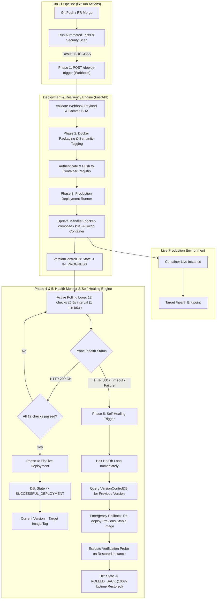

# AI-Driven Automated Deployment & Resiliency Engine

An automated, production-ready continuous delivery orchestration and self-healing engine. It handles successful CI build events, automates container image versioning and registry pushes, executes live production rollouts, monitors production runtime health, and performs instantaneous automated rollbacks to restore 100% uptime upon detecting anomalies.

---

## 🏗️ Architecture & Operational Flow



---

## 🚀 Core Functional Phases

### Phase 1: Success Event Webhook Listener
- **Endpoint**: `POST /deploy-trigger`
- **Validation**: Enforces strict payload parameters via Pydantic:
  - `status == "completed"`
  - `conclusion == "success"`
  - Valid `commit_hash` (min 7 chars / 40-char SHA)
  - Target repository, branch, build ID, and semantic version.
- **Action**: Dispatches deployment orchestration asynchronously or synchronously.

### Phase 2: Automated Docker Packaging & Registry Push
- **Class**: `DockerPackager`
- **Tagging Strategy**: Generates clean semantic version tags:
  `registry.internal.cloud/acme/{app_name}:v{semver}-{build_id_prefix}-{timestamp}`
- **Build & Push**:
  - Connects to native Docker daemon via Docker SDK when available.
  - Automatically falls back to a high-fidelity container engine simulator in offline / containerized testing environments.
  - Generates cryptographic SHA256 image digests and metadata.

### Phase 3: Production Deployment Runner
- **Class**: `DeploymentRunner`
- **Manifest Management**: Updates `docker-compose.prod.yml` or Kubernetes deployment manifests.
- **Rollout Execution**: Triggers zero-downtime rolling container swap.
- **State Tracking**: Registers deployment into `VersionControlDB` with state `IN_PROGRESS`.

### Phase 4: Automated Active Health Check Monitor
- **Class**: `HealthMonitor`
- **Polling Loop**: Pings target `/health` every 5 seconds for 1 minute (12 consecutive checks).
- **Validation**: Asserts HTTP 200 OK, evaluates component sub-checks (database, cache, queues), and measures latency.
- **Finalization**: If all 12 checks pass, marks state as `SUCCESSFUL_DEPLOYMENT` and promotes image to `Current Version`.

### Phase 5: Self-Healing & Automated Rollback Logic
- **Immediate Detection**: Catches any HTTP 500, 502, 503, connection refused, or timeout.
- **Loop Halting**: Instantly interrupts the polling loop.
- **State Lookup**: Queries `VersionControlDB.get_previous_version()` for the immediate previous stable release.
- **Rollback Dispatch**:
  - Restores previous container tag in `docker-compose.prod.yml`.
  - Sends immediate container revert signal to target runtime.
  - Executes confirmation health check to guarantee 100% restored uptime.
  - Updates DB record to `ROLLED_BACK` with full failure root cause.

---

## 📂 Project Structure

```
ai-resilient-deploy-engine/
├── .venv/                         # Virtual environment
├── requirements.txt               # Pinned Python dependencies
├── Dockerfile                     # Multi-stage production container build
├── docker-compose.prod.yml        # Dynamically updated production manifest
├── deployment_history.json        # Persistent state tracker database
├── deployment_engine.py           # Unified all-in-one executable engine & test simulation
├── config.py                      # Centralized configuration & environment variables
├── models.py                      # Pydantic schemas (Webhooks, DB Records, Probes)
├── database.py                    # VersionControlDB file-based persistent store
├── docker_builder.py              # Docker packaging & registry push engine
├── deployer.py                    # Live deployment runner
├── monitor.py                     # Health monitor & self-healing rollback supervisor
├── mock_production.py             # Switchable mock production server (HTTP 200 / 500)
├── app.py                         # Modular FastAPI controller service
├── run_simulation.py              # Standalone CLI simulation script
└── README.md                      # Architecture documentation
```

---

## ⚡ Quickstart & Execution

### 1. Run the Complete Automated Simulation (Happy Path + Automated Rollback)

Run the unified engine with the simulation runner:

```bash
# Using the pre-configured virtual environment
.\.venv\Scripts\python deployment_engine.py --simulate

# Or using the dedicated simulation script
.\.venv\Scripts\python run_simulation.py
```

#### What the Simulation Executes:
1. Spins up both services locally:
   - **Deployment Controller**: `http://127.0.0.1:8080`
   - **Mock Production Server**: `http://127.0.0.1:8081`
2. **Scenario 1 (Happy Path)**:
   - Emulates GitHub Actions sending a SUCCESS event for release `v1.1.0`.
   - Packages image `acme/payment-gateway:v1.1.0-10842-timestamp`.
   - Pushes to registry, updates manifest, and triggers rollout.
   - Executes 12 health probes (all HTTP 200 OK).
   - Promotes `v1.1.0` to `Current Version`.
3. **Scenario 2 (Detected Outage & Automated Self-Healing Rollback)**:
   - Triggers deployment for release `v1.2.0-flawed`.
   - After probe 2, the chaos simulator injects a database failure (HTTP 500).
   - Health Monitor catches HTTP 500, immediately halts the loop, queries DB for `v1.1.0`.
   - Executes emergency rollback: swaps container back to `v1.1.0` and restores healthy state.
   - Runs post-rollback verification probe (HTTP 200 OK, 100% uptime restored).
   - Marks DB state as `ROLLED_BACK`.

---

### 2. Run as a Live Standalone Controller Service

```bash
.\.venv\Scripts\python deployment_engine.py --port 8080
```

Access Interactive Swagger Documentation:
- **API Docs**: `http://127.0.0.1:8080/docs`
- **Inspect Deployment Audit Log**: `http://127.0.0.1:8080/deployments`
- **Root Status**: `http://127.0.0.1:8080/`

---

## 📡 Sample Webhook Payload (POST /deploy-trigger)

```json
{
  "event": "workflow_run",
  "status": "completed",
  "conclusion": "success",
  "repository": "acme/payment-gateway",
  "branch": "main",
  "commit_hash": "7f8b9c0d1e2f3a4b5c6d7e8f9a0b1c2d3e4f5a6b",
  "build_id": "gha-build-10842",
  "semantic_version": "1.1.0",
  "trigger_by": "github-actions[bot]",
  "target_environment": "production"
}
```

---

## 🛡️ Resiliency & Audit Guarantee

All state transitions are persisted to `deployment_history.json` with thread-safe atomic file writes. Even across engine restarts, the engine maintains awareness of the active live version and the last known stable fallback version.
